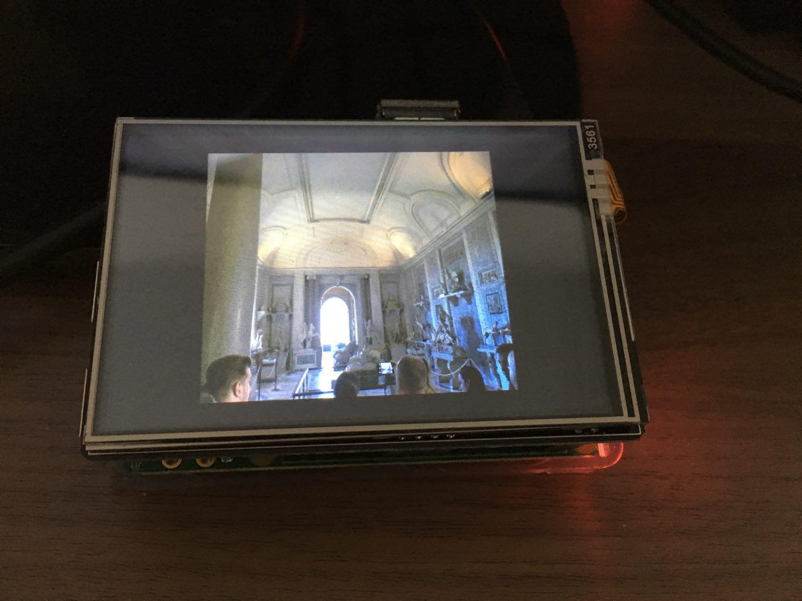

# Digital-Picture-Frame
A digital picture frame software for anyone. The software detects pictures and videos (*.mov) videos at a given path. The *Digital Picture Frame* frames the pictures and videos one by one like a screensaver.

## Installation
### Prerequisites
Make sure you have the following components installed

* [CMake](https://cmake.org/download/)
* A [c-Compiler](https://wiki.ubuntuusers.de/GCC/).
* [vlc](http://www.videolan.org/vlc/index.de.html) package
* [libvlc-dev](https://wiki.videolan.org/LibVLC_Tutorial/) package

You can use the [dependecy script](digitalPictureFramePackageDependencies.sh) to install all required packages on Linux but you must have root permissions.

### Software install
```bash
git clone https://github.com/icebreaker2/Digital-Picture-Frame.git
cd Digital-Picture-Frame
```

Now run start the `CMakeLists.txt` or compile yourself (familiar to):
```bash
gcc -std=c99 -Wall -Iinclude/modules src/modules/VLCPlayer.c src/modules/FileIterator.c src/main.c -o digitalPictureFrame -lvlc 
```
and run
```bash
./digitalPictureFrame
```
or use the [Start script](Digital_Picture_Frame.sh).

## Developer Notes
I have tried to run the implementation on a raspberry pi. It works fine but depending on the video type the frame buffer cannot handle it correctly, meaning videos cannot be displayed correctly on a raspberry pi. Overclocking and increasing the gpu buffer did not show any improved performance. I have used the a 1080p LCD Panel for with a [raspberry pi 2b](https://www.amazon.de/Raspberry-Pi-quad-core-Cortex-A7-compatibility/dp/B00T2U7R7I/ref=sr_1_1?ie=UTF8&qid=1498120753&sr=8-1&keywords=raspberry+pi+2+b) and [Raspbian Jessie Lite](https://www.raspberrypi.org/downloads/raspbian/) with the following packages installed to get a minimal graphical interface for `vlc`:
* `xserver-xorg`
* `xinit`
* `lxde-core`
* `lxappearance`
* `lightdm`

It may work better with the new generation of the raspberry pi but not for sure.

You can register the [Start script](Digital_Picture_Frame.sh) within the auto start script - choose your prefered way. I have excluded videos for the raspberry pi using the raspberry pi just for pictures to display.



